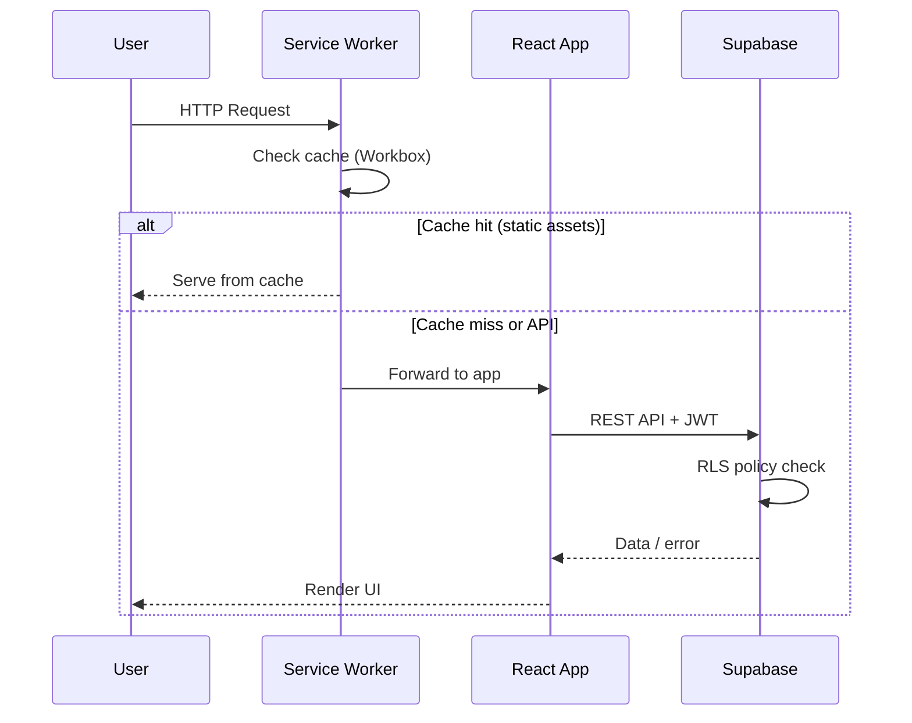
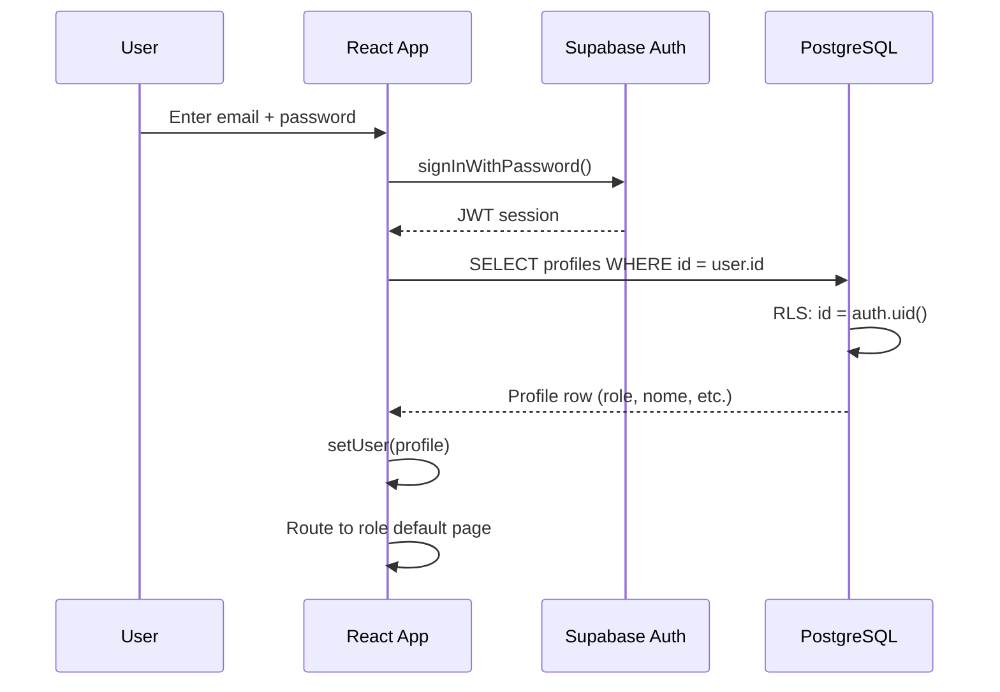

# 01 — Architecture

**Gracie Barra Braga — Management Platform**  
Tribo Laurada Lda. · NIF 518948471 · Rua Nova Santa Cruz 11, 4710-409 Braga

---

## 1. Overview

The GB Braga platform is a **Progressive Web App (PWA)** built with React 19 and TypeScript, backed by **Supabase** (PostgreSQL, Auth, Storage, Realtime, Edge Functions) and deployed on **Vercel**. It serves five distinct user roles through a single-page application with role-based access control enforced at both the frontend routing layer and the database layer via Row Level Security (RLS).

---

## 2. Architecture Diagram

```mermaid
graph TD
    subgraph Client ["Client (Browser / PWA)"]
        SW[Service Worker<br/>Workbox]
        React[React 19 SPA<br/>TypeScript]
        SW <-->|Cache Strategies| React
    end

    subgraph Vercel ["Vercel CDN"]
        Static[Static Assets<br/>dist/]
        APIRoute[/api/stripe-webhook<br/>Serverless Function]
    end

    subgraph Supabase ["Supabase (eu-west-1)"]
        Auth[Auth Service<br/>JWT]
        DB[(PostgreSQL<br/>+ RLS)]
        Storage[Object Storage<br/>avatars bucket]
        Realtime[Realtime<br/>WebSocket]
        EdgeFn[Edge Functions<br/>Deno Runtime]
    end

    subgraph External ["External Services"]
        Stripe[Stripe<br/>Payments]
        Resend[Resend API<br/>Email]
        TOConline[TOConline<br/>Invoicing]
        WhatsApp[Meta WhatsApp<br/>Business API]
    end

    React -->|REST + JWT| DB
    React -->|Auth SDK| Auth
    React -->|Upload/Download| Storage
    React -->|WebSocket| Realtime
    React -->|Invoke| EdgeFn
    EdgeFn -->|SMTP / Resend API| Resend
    EdgeFn -->|OAuth| TOConline
    APIRoute -->|Webhook events| DB
    Stripe -->|Webhook| APIRoute
    React -->|Stripe.js| Stripe
```

---

## 3. Technology Stack

| Layer | Technology | Version | Purpose |
|---|---|---|---|
| Frontend Framework | React | 19.2.5 | Component-based UI |
| Language | TypeScript | ~6.0.2 | Type safety |
| Build Tool | Vite | 8.0.10 | Dev server + bundler |
| PWA | vite-plugin-pwa | 1.3.0 | Service worker, manifest |
| PDF Generation | jsPDF | 4.2.1 | Contract / report export |
| Backend / DB | Supabase | 2.45.4 | Auth, DB, Storage, Realtime |
| Database | PostgreSQL 15 | via Supabase | Relational data store |
| Hosting | Vercel | — | CDN + Serverless Functions |
| Edge Functions | Deno | via Supabase | Email, TOConline, invites |
| Payments | Stripe | — | Subscription billing |
| Email | Resend API | — | Transactional email |
| Invoicing | TOConline | — | Portuguese fiscal compliance |

---

## 4. Request Lifecycle



---

## 5. Authentication Flow



**Staff Invite Flow:**
1. Admin calls `invite-staff` Edge Function → Supabase creates user + sends recovery email
2. Staff clicks link → `PASSWORD_RECOVERY` event fires → `SetPasswordScreen` shown
3. Staff sets password → `completePasswordSetup()` → normal session

---

## 6. Authorization Architecture

Authorization is enforced at **three levels**:

### Level 1 — Frontend Routing (App.tsx)
```typescript
PAGE_ROLES: Record<string, UserRole[]>  // which roles can see which page
canAccess(role, page): boolean
canAccessModule(page, isActive): boolean  // checks if module is enabled
```

### Level 2 — Database RLS (PostgreSQL)
Every table has RLS enabled. The helper function `auth_role()` (SECURITY DEFINER) reads the caller's role from `profiles` without triggering recursive RLS checks.

### Level 3 — Module System (useModulos)
Superadmin can disable optional modules. The `isActive(id)` function checks `configuracoes.dados` (JSONB) and applies to both sidebar visibility and page routing.

---

## 7. Data Flow — Module System

```mermaid
graph LR
    SA[Superadmin] -->|toggle()| DB[(configuracoes<br/>secao=modulos)]
    DB -->|Realtime broadcast| AllSessions[All Active Sessions]
    AllSessions -->|isActive()| Sidebar[Sidebar visibility]
    AllSessions -->|canAccessModule()| Router[Page routing]
```

---

## 8. PWA Architecture

The Service Worker (Workbox) uses three caching strategies:

| Pattern | Strategy | TTL |
|---|---|---|
| Static assets (JS/CSS/HTML) | Pre-cache | App version |
| Supabase REST API | NetworkFirst | 5 minutes |
| Supabase Storage (images) | StaleWhileRevalidate | 24 hours |
| Google Fonts | CacheFirst | 1 year |

The PWA supports **offline-first** reading of cached data, with writes queued until connectivity is restored.

---

## 9. Folder Structure

```
gb-braga-app/
├── api/                        # Vercel serverless functions
│   └── stripe-webhook.ts       # Stripe webhook handler
├── documentation/              # This documentation
├── public/                     # Static assets served as-is
│   ├── favicon.svg
│   ├── icons.svg
│   └── logo.png
├── scripts/                    # Setup utilities
│   ├── setup.sh
│   └── validate-env.js
├── src/
│   ├── components/
│   │   ├── GBLogo.tsx          # Brand logo component
│   │   ├── common/             # Reusable UI primitives (Button, Card, Modal, Badge, ...)
│   │   ├── features/           # Feature-scoped components (scaffolded)
│   │   └── layout/
│   │       └── Layout.tsx      # App shell (sidebar, nav, mobile)
│   ├── data/
│   │   └── mockData.ts         # Demo mode mock users
│   ├── hooks/                  # useProfile, useConfiguracoes, useAlunoInfo, usePedidosNumerario
│   ├── lib/
│   │   ├── auth.tsx            # AuthContext + useAuth hook
│   │   ├── alunoDomain.ts      # Aluno domain helpers (belt lists, plan helpers)
│   │   ├── gbBrand.ts          # Belt colors, brand constants
│   │   ├── icons.tsx           # FontAwesome icon wrappers
│   │   ├── queries.ts          # TanStack Query keys/helpers
│   │   ├── supabase.ts         # Supabase data functions (legacy)
│   │   ├── supabaseClient.ts   # Supabase client singleton
│   │   ├── useData.ts          # Data hooks (useAlunos, useTurmas, etc.)
│   │   ├── useMobile.ts        # Responsive breakpoint hook
│   │   └── useModulos.tsx      # Module management context
│   ├── pages/
│   │   ├── LoginPage.tsx
│   │   ├── PerfilPage.tsx      # User profile (all roles)
│   │   ├── admin/              # Staff pages
│   │   │   ├── AlunosPage.tsx
│   │   │   ├── ChatPage.tsx
│   │   │   ├── CheckinPage.tsx
│   │   │   ├── ComunicacaoPage.tsx
│   │   │   ├── ConfigPage.tsx
│   │   │   ├── ContratosPage.tsx
│   │   │   ├── Dashboard.tsx
│   │   │   ├── FinanceiroPage.tsx
│   │   │   ├── GraduacaoPage.tsx
│   │   │   ├── IntegracoesPage.tsx
│   │   │   ├── KioskMode.tsx
│   │   │   ├── ModulosPage.tsx
│   │   │   ├── NovaMatriculaModal.tsx
│   │   │   ├── PendentesNumerario.tsx
│   │   │   ├── ProfessoresPage.tsx
│   │   │   ├── SpecialPages.tsx
│   │   │   └── TurmasPage.tsx
│   │   ├── aluno/              # Student portal pages
│   │   │   ├── Conteudo.tsx
│   │   │   ├── Mensagens.tsx
│   │   │   ├── MeuCheckin.tsx
│   │   │   ├── MeuFinanceiro.tsx
│   │   │   ├── MinhaEvolucao.tsx
│   │   │   ├── MinhasAulas.tsx
│   │   │   ├── PortalAluno.tsx
│   │   │   └── PortalPageHeader.tsx
│   │   ├── matricula/
│   │   │   └── FluxoMatricula.tsx  # Enrollment wizard
│   │   ├── professor/
│   │   │   └── ProfessorView.tsx
│   │   └── public/
│   │       └── MatriculaPublica.tsx  # Public enrollment page
│   ├── services/
│   │   ├── api/                # edgeFunctions.ts, toconline.ts
│   │   ├── pdf/                # contrato.ts, csv.ts, report.ts (jsPDF)
│   │   └── geo.ts               # Haversine distance for GPS check-in
│   ├── types/
│   │   └── index.ts            # TypeScript interfaces + enums
│   ├── App.tsx                 # Root component, routing
│   ├── index.css               # Global styles
│   └── main.tsx                # React entry point
├── supabase/
│   ├── functions/
│   │   ├── invite-staff/       # Edge Function: create staff user
│   │   └── send-email/         # Edge Function: SMTP/Resend email
│   ├── patches/                # Incremental SQL migrations
│   └── schema.sql              # Full database schema
├── .env.example                # Environment variable template
├── vercel.json                 # Vercel deployment config + security headers
├── vite.config.ts              # Vite + PWA configuration
└── package.json
```

---

## 10. Security Architecture

| Concern | Implementation |
|---|---|
| Transport | HTTPS enforced by Vercel |
| Authentication | Supabase Auth JWT (HS256) |
| Authorization | RLS + frontend role checks |
| XSS | `X-XSS-Protection` header, React's built-in escaping |
| Clickjacking | `X-Frame-Options: DENY` |
| MIME sniffing | `X-Content-Type-Options: nosniff` |
| Geolocation | `Permissions-Policy: geolocation=(self)` |
| Secrets | Env vars, never in frontend bundle except `VITE_` prefixed public keys |
| Camera/Mic | Blocked via Permissions-Policy |
