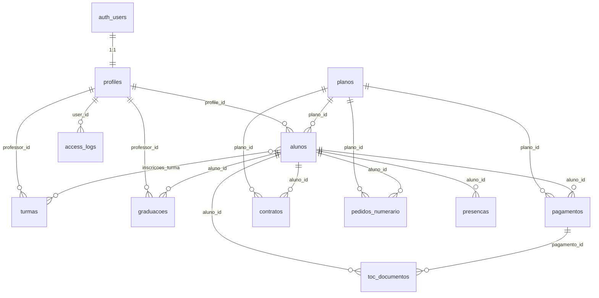

# 06 — Database Documentation

**Supabase PostgreSQL — Gracie Barra Braga**

---

## 1. Overview

- **Engine:** PostgreSQL 15 (via Supabase, region: eu-west-1)
- **Project ID:** `yrfdxocwhztokadzxtto`
- **RLS:** Enabled on all user-facing tables
- **Extensions:** `uuid-ossp`
- **Tables:** 13 main tables + 1 join table + 1 view
- **Functions:** 4 SECURITY DEFINER functions + 2 triggers

---

## 2. Entity Relationship Diagram

---

## 3. Tables

### 3.1 `profiles`

Extension of Supabase Auth users. Created automatically by trigger `on_auth_user_created`.

| Column | Type | Nullable | Default | Notes |
|---|---|---|---|---|
| id | UUID | NO | — | FK → auth.users(id), CASCADE delete |
| nome | TEXT | NO | — | Display name |
| email | TEXT | NO | — | UNIQUE |
| role | user_role | NO | 'aluno' | Enum: superadmin/admin/atendimento/professor/aluno |
| telefone | TEXT | YES | — | |
| matricula_completa | BOOLEAN | NO | FALSE | Set true after enrollment wizard |
| avatar_url | TEXT | YES | — | Supabase Storage path |
| faixa | TEXT | YES | — | Belt (for staff display) |
| ativo | BOOLEAN | YES | TRUE | Staff active status |
| created_at | TIMESTAMPTZ | NO | NOW() | |
| updated_at | TIMESTAMPTZ | NO | NOW() | Auto-updated by trigger |

**RLS Policies:**
- SELECT: own row OR admin/superadmin/atendimento
- UPDATE: admin/superadmin OR own row (Aluno atualiza próprio perfil)
- INSERT: admin/superadmin

**Indexes:** PRIMARY KEY on `id`, UNIQUE on `email`

---

### 3.2 `alunos`

Core student record. May be linked to a profile (for students with app access) or standalone (for staff-managed entries).

| Column | Type | Nullable | Default | Notes |
|---|---|---|---|---|
| id | UUID | NO | uuid_generate_v4() | PK |
| profile_id | UUID | YES | — | FK → profiles(id), SET NULL |
| nome | TEXT | NO | — | |
| email | TEXT | NO | — | UNIQUE |
| telefone | TEXT | YES | — | |
| whatsapp | TEXT | YES | — | |
| data_nascimento | DATE | YES | — | |
| nif | TEXT | YES | — | Portuguese tax ID |
| morada | TEXT | YES | — | Address |
| cod_postal | TEXT | YES | — | Postal code |
| faixa | belt_type | NO | 'branca' | |
| grau | SMALLINT | NO | 0 | 0–4 (stripes) |
| data_matricula | DATE | NO | CURRENT_DATE | |
| plano_id | TEXT | YES | — | FK → planos(id) |
| plano_nome | TEXT | YES | — | Denormalized for performance |
| status | aluno_status | NO | 'ativo' | ativo/inativo/suspenso |
| frequencia | SMALLINT | NO | 0 | Attendance % (0–100) |
| responsavel | TEXT | YES | — | Guardian name (minors) |
| responsavel_nif | TEXT | YES | — | Guardian NIF |
| responsavel_email | TEXT | YES | — | |
| responsavel_tel | TEXT | YES | — | |
| enc_pagamento | TEXT | YES | 'aluno' | Payment responsible |
| stripe_customer_id | TEXT | YES | — | UNIQUE |
| stripe_subscription_id | TEXT | YES | — | UNIQUE |
| metodo_pagamento | payment_method | NO | 'stripe' | stripe/numerario/transferencia |
| numerario_aprovado | BOOLEAN | NO | FALSE | Cash payment approved |
| numerario_aprovado_por | UUID | YES | — | FK → profiles(id) |
| created_at | TIMESTAMPTZ | NO | NOW() | |
| updated_at | TIMESTAMPTZ | NO | NOW() | Auto-updated |

**Indexes:**
- `idx_alunos_email` on `email`
- `idx_alunos_status` on `status`
- `idx_alunos_plano` on `plano_id`

**RLS Policies:**
- SELECT: own email match OR admin/superadmin/atendimento/professor
- ALL: admin/superadmin/atendimento
- INSERT: own email OR admin (enrollment self-registration)

---

### 3.3 `planos`

Subscription plan catalog.

| Column | Type | Nullable | Notes |
|---|---|---|---|
| id | TEXT | NO | PK (e.g. 'pl-adulto-plus') |
| nome | TEXT | NO | Display name |
| valor | NUMERIC(8,2) | NO | Price incl. 23% IVA |
| descricao | TEXT | YES | |
| categoria | TEXT | NO | CHECK: adulto/kids/familia/fundador |
| ativo | BOOLEAN | NO | TRUE |
| stripe_product_id | TEXT | YES | |
| stripe_price_id_live | TEXT | YES | Live mode Stripe price |
| stripe_price_id_test | TEXT | YES | Test mode Stripe price |
| created_at | TIMESTAMPTZ | NO | |

No RLS (public read is intentional for enrollment flow).

---

### 3.4 `turmas`

Class schedule entries.

| Column | Type | Nullable | Notes |
|---|---|---|---|
| id | UUID | NO | PK |
| nome | TEXT | NO | e.g. "GB 1 — Técnica" |
| professor_id | UUID | YES | FK → profiles |
| professor_nome | TEXT | YES | Denormalized |
| horario | TEXT | NO | e.g. "07:00" |
| dias_semana | TEXT[] | NO | e.g. ['segunda','terça'] |
| sala | TEXT | YES | |
| capacidade | SMALLINT | NO | 20 |
| nivel | turma_nivel | NO | iniciante/intermediario/avancado/kids/all |
| tipo | turma_tipo | NO | gi/nogi/wrestling/kids |
| cor | TEXT | YES | Hex color for calendar view |
| ativa | BOOLEAN | NO | TRUE |
| created_at | TIMESTAMPTZ | NO | |

---

### 3.5 `inscricoes_turma`

Many-to-many join between alunos and turmas.

| Column | Type | Notes |
|---|---|---|
| aluno_id | UUID | PK (composite), FK → alunos |
| turma_id | UUID | PK (composite), FK → turmas |
| data_inscricao | DATE | |
| ativa | BOOLEAN | |

---

### 3.6 `pagamentos`

Payment records (Stripe + manual).

| Column | Type | Nullable | Notes |
|---|---|---|---|
| id | UUID | NO | PK |
| aluno_id | UUID | NO | FK → alunos |
| aluno_nome | TEXT | NO | Denormalized |
| plano_id | TEXT | YES | FK → planos |
| plano_nome | TEXT | YES | Denormalized |
| valor | NUMERIC(8,2) | NO | |
| vencimento | DATE | NO | Due date |
| data_pagamento | TIMESTAMPTZ | YES | Actual payment date |
| status | payment_status | NO | pago/pendente/vencido/cancelado |
| metodo | payment_method | YES | stripe/numerario/transferencia |
| stripe_payment_id | TEXT | YES | UNIQUE |
| stripe_invoice_id | TEXT | YES | |
| toc_numero | TEXT | YES | TOConline invoice number |
| descricao | TEXT | YES | |
| created_at | TIMESTAMPTZ | NO | |

**Indexes:**
- `idx_pagamentos_aluno` on `aluno_id`
- `idx_pagamentos_status` on `status`
- `idx_pagamentos_vencimento` on `vencimento`

---

### 3.7 `presencas`

Attendance records (check-in/checkout).

| Column | Type | Notes |
|---|---|---|
| id | UUID | PK |
| aluno_id | UUID | FK → alunos |
| aluno_nome | TEXT | Denormalized |
| turma_id | UUID | FK → turmas (nullable) |
| turma_nome | TEXT | |
| data | DATE | |
| hora | TIME | |
| tipo | TEXT | checkin / checkout |
| metodo | TEXT | gps / qrcode / manual / app |
| gps_lat | NUMERIC(10,7) | GPS latitude at check-in |
| gps_lng | NUMERIC(10,7) | GPS longitude at check-in |
| gps_dist_m | NUMERIC(6,1) | Distance from academy in meters |
| created_at | TIMESTAMPTZ | |

**Indexes:**
- `idx_presencas_aluno_data` on (aluno_id, data)
- `idx_presencas_data` on data

---

### 3.8 `contratos`

Enrollment contracts (signed digitally during enrollment wizard).

| Column | Type | Notes |
|---|---|---|
| id | UUID | PK |
| aluno_id | UUID | FK → alunos |
| aluno_nome | TEXT | |
| aluno_nif | TEXT | |
| plano_id | TEXT | FK → planos |
| plano_nome | TEXT | |
| valor | NUMERIC(8,2) | |
| data_inicio | DATE | |
| data_fim | DATE | |
| status | contrato_status | ativo/cancelado/expirado |
| assinado | BOOLEAN | |
| data_assinatura | TIMESTAMPTZ | |
| assinatura_img | TEXT | Base64 PNG of canvas signature |
| aceita_imagem | BOOLEAN | GDPR: image rights consent |
| aceita_rgpd | BOOLEAN | GDPR consent |
| aceita_contrato | BOOLEAN | Terms acceptance |
| enc_pagamento | TEXT | |
| created_at | TIMESTAMPTZ | |

---

### 3.9 `graduacoes`

Belt promotion history.

| Column | Type | Notes |
|---|---|---|
| id | UUID | PK |
| aluno_id | UUID | FK → alunos |
| aluno_nome | TEXT | |
| faixa_anterior | belt_type | Previous belt |
| grau_anterior | SMALLINT | Previous degree |
| faixa_nova | belt_type | New belt |
| grau_novo | SMALLINT | New degree |
| data | DATE | |
| professor_id | UUID | FK → profiles |
| professor_nome | TEXT | |
| observacao | TEXT | |
| notificado_wa | BOOLEAN | WhatsApp notification sent |
| created_at | TIMESTAMPTZ | |

---

### 3.10 `mensagens`

Communication records (email, WhatsApp, SMS).

| Column | Type | Notes |
|---|---|---|
| id | UUID | PK |
| para_id | TEXT | Recipient aluno ID or 'all' |
| para_nome | TEXT | |
| canal | msg_canal | whatsapp/sms/email/push |
| assunto | TEXT | Email subject |
| corpo | TEXT | Message body |
| status | msg_status | enviado/pendente/erro/lido |
| remetente | TEXT | Sender identifier |
| agendado_para | TIMESTAMPTZ | Scheduled send time |
| enviado_em | TIMESTAMPTZ | Actual send time |
| created_at | TIMESTAMPTZ | |

---

### 3.11 `toc_documentos`

TOConline fiscal documents (invoices/receipts).

| Column | Type | Notes |
|---|---|---|
| id | UUID | PK |
| numero | TEXT | UNIQUE, e.g. "FR 2025/1001" |
| tipo | TEXT | FR/FT/FS |
| data_emissao | DATE | |
| aluno_id | UUID | FK → alunos |
| aluno_nome | TEXT | |
| plano_nome | TEXT | |
| valor_total | NUMERIC(8,2) | |
| iva_total | NUMERIC(8,2) | |
| valor_sem_iva | NUMERIC(8,2) | |
| pagamento_id | UUID | FK → pagamentos |
| stripe_payment_id | TEXT | |
| pdf_url | TEXT | |
| estado | TEXT | emitida/enviada/erro |
| created_at | TIMESTAMPTZ | |

---

### 3.12 `pedidos_numerario`

Cash payment requests (students who cannot pay by Stripe).

| Column | Type | Notes |
|---|---|---|
| id | UUID | PK |
| aluno_id | UUID | FK → alunos |
| nome_aluno | TEXT | |
| email | TEXT | |
| telefone | TEXT | |
| plano_id | TEXT | FK → planos |
| plano_nome | TEXT | |
| valor | NUMERIC(8,2) | |
| status | TEXT | pendente/aprovado/rejeitado |
| nota_admin | TEXT | |
| aprovado_por | UUID | FK → profiles |
| aprovado_em | TIMESTAMPTZ | |
| created_at | TIMESTAMPTZ | |

---

### 3.13 `configuracoes`

Key-value store for application configuration.

| Column | Type | Notes |
|---|---|---|
| secao | TEXT | PK — section name (e.g. 'modulos', 'academia', 'email') |
| dados | JSONB | Configuration object |
| updated_at | TIMESTAMPTZ | |
| updated_by | UUID | FK → profiles |

**Known sections:**
- `modulos` — Module enable/disable states
- `academia` — Academy info + GPS coordinates + fence radius
- `email` — SMTP/Resend configuration

---

### 3.14 `templates_mensagem`

Message templates for the communication module.

| Column | Notes |
|---|---|
| id | UUID PK |
| nome | Template name |
| canal | whatsapp/email/sms |
| assunto | Email subject (nullable) |
| corpo | Template body |
| created_at | |

---

### 3.15 `access_logs`

Security audit log.

| Column | Notes |
|---|---|
| id | UUID PK |
| user_id | FK → profiles |
| user_email | Denormalized |
| role | Role at time of action |
| action | Action identifier |
| details | JSONB extra context |
| ip | Client IP |
| created_at | |

---

## 4. Views

### `v_kpis`

Dashboard KPI aggregation view:
- `total_alunos` — Total student count
- `alunos_ativos` — Active students
- `receita_mensal` — Current month paid revenue
- `receita_prevista` — Current month pending revenue
- `novos_alunos` — New students in last 30 days
- `inadimplentes` — Students with pending/overdue payments

---

## 5. Functions

| Function | Returns | Purpose |
|---|---|---|
| `auth_role()` | TEXT | SECURITY DEFINER: current user's role from profiles |
| `my_aluno_id()` | UUID | SECURITY DEFINER: current user's aluno ID |
| `calcular_frequencia(UUID, INT)` | INT | Attendance % over N months |
| `handle_new_user()` | TRIGGER | Auto-create profile on auth.users INSERT |
| `set_updated_at()` | TRIGGER | Auto-update updated_at on row change |

---

## 6. Enums

| Enum | Values |
|---|---|
| `user_role` | superadmin, admin, atendimento, professor, aluno |
| `belt_type` | branca, cinza, amarela, laranja, verde, azul, roxa, marrom, preta |
| `payment_status` | pago, pendente, vencido, cancelado |
| `payment_method` | stripe, numerario, transferencia |
| `aluno_status` | ativo, inativo, suspenso |
| `turma_nivel` | iniciante, intermediario, avancado, kids, all |
| `turma_tipo` | gi, nogi, wrestling, kids |
| `msg_canal` | whatsapp, sms, email, push |
| `msg_status` | enviado, pendente, erro, lido |
| `contrato_status` | ativo, cancelado, expirado |

> **Note:** The TypeScript `Belt` type includes full kids progression variants (e.g. `cinza-branca`, `cinza-preta`) that are not yet in the `belt_type` enum. The DB enum and TypeScript type are **out of sync** — a migration to expand the enum is required before storing kids belt grades directly in the `alunos` table.

---

## 7. Performance Recommendations

| Priority | Recommendation |
|---|---|
| High | Add index on `presencas(turma_id)` for class attendance reports |
| High | Add index on `pagamentos(vencimento, status)` for overdue reports |
| Medium | Materialize `v_kpis` as a scheduled refresh for large datasets |
| Medium | Partition `presencas` by month when > 100k rows |
| Low | Add `graduacoes(aluno_id, data)` composite index |
| Low | Consider JSONB GIN index on `configuracoes(dados)` |

---

## 8. Backup & Recovery

Supabase provides automatic daily backups (PITR available on Pro plan). Recommended:
- Enable PITR (Point-in-Time Recovery) for production
- Export schema weekly via `supabase db dump`
- Test restore procedure quarterly
